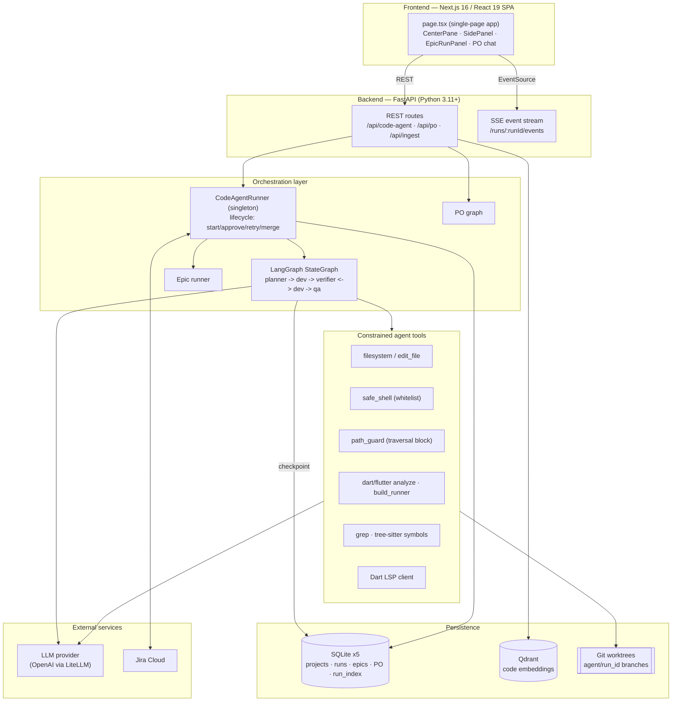
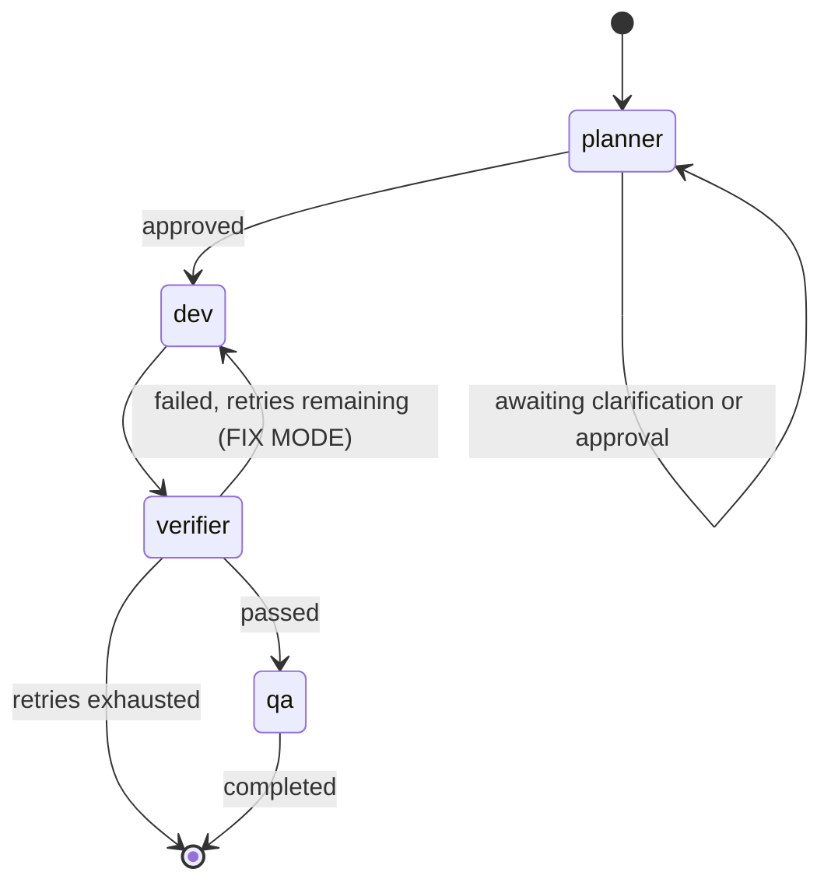
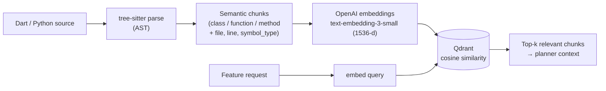

# Autonomous Code Agent — Architecture & Technical Decision Record

**Audience:** Engineering leadership
**Author:** Engineering Architecture
**Status:** Living document
**Last reviewed:** 2026-07-05

---

## 1. Executive summary

This system is an **autonomous software-engineering agent** that takes a work item — a free-text
request or a Jira ticket — and drives it end to end: it understands the target codebase, produces a
reviewable implementation plan, writes the code in an isolated Git branch, compiles and verifies its
own output, and hands back a diff ready for merge. It is purpose-built for **Flutter/Dart** target
projects and is currently oriented toward test and feature generation.

It goes beyond a single LLM call. The core is a **stateful multi-agent workflow** (Planner → Dev →
Verifier ⇄ Dev → QA) with a human approval gate, retrieval-augmented context, deterministic
compile/analyze gates, and full run-level observability. Two higher-order pipelines sit on top: an
**Epic runner** that decomposes and executes a whole Jira epic across a dependency graph, and a
**Product-Owner (PO) agent** that turns vague ideas into well-formed user stories before any code is
written.

The rest of this document describes what is built, how the pieces fit, and — most importantly — **why
each significant technology was chosen over the alternatives**.

---

## 2. What the system does (product framing)

| Capability | Description |
|---|---|
| **Ingest & understand a codebase** | Parses Dart/Python source into semantic chunks and embeds them into a vector store for retrieval. |
| **Plan a change** | An LLM "architect" agent discovers the relevant files, produces a file-accurate plan + testable acceptance criteria, and pauses for human approval. |
| **Implement** | A "developer" agent iteratively edits files inside a dedicated Git worktree using a constrained tool set. |
| **Verify** | Deterministic gates (`dart analyze`, `build_runner`, scoped tests, DI-registration checks) plus an LLM review confirm the change matches the plan; failures loop back to the developer. |
| **QA & merge** | Final diff review, then a guarded merge into the base branch. |
| **Epic orchestration** | Decomposes a Jira epic into child stories, runs independent stories concurrently, and merges each level into a shared integration branch. |
| **Requirement intake (PO agent)** | Brainstorms/validates requirements into structured user stories before engineering begins. |
| **Jira integration** | Pulls tickets (with acceptance criteria, links, attachments) into the local store and can push status transitions back. |

---

## 3. System architecture (high level)

### Repository layout

| Path | Role |
|---|---|
| `api/tester-rag-api/` | FastAPI backend — RAG pipeline + LangGraph multi-agent workflow |
| `ui/code_agent_web/` | Next.js 16 (App Router) frontend, single-page app |

---

## 4. The core code-agent pipeline

The heart of the system is a **LangGraph `StateGraph`** (`app/orchestration/graph.py`) with four nodes
and one conditional loop:

- **Planner** (`agents/roles/planner.py`) — a senior-architect prompt. It runs an optional
  **agentic discovery** loop first (a read-only Explorer that greps/reads files, Cursor-style) so the
  plan cites *actual* file paths instead of pausing to ask "which files?". Emits a structured JSON plan
  (`files_to_create`, `files_to_modify`, `architecture`, `acceptance_criteria`, `plan_markdown`) or
  clarification questions. Then the run halts for **human approval** (or auto-approves when configured).
- **Dev** (`agents/roles/dev.py`) — a **native tool-calling loop** (up to 40 steps; the model stops
  naturally when it emits no tool call). It writes into a Git worktree using a plan-scoped tool set.
  On a verifier retry it enters **FIX MODE**: it is handed the current file contents plus an explicit
  fix checklist and is instructed to patch, not rewrite.
- **Verifier** (`agents/roles/verifier.py`) — a **two-stage gate**: (1) a deterministic gate runs
  `pub get` → `build_runner` → `dart analyze` → scoped `flutter test` → DI-registration evidence check;
  (2) only if that passes does an LLM review compare the diff against acceptance criteria. On failure it
  routes back to Dev with actionable `required_fixes` (bounded by `max_iterations`, default 3).
- **QA** (`agents/roles/qa.py`) — final holistic diff review, produces `qa_report`, sets status
  `completed`.

**State** (`FeatureRunState`, a `TypedDict`) is persisted by LangGraph's `AsyncSqliteSaver`
(WAL mode). Each user-triggered retry is a **new execution with its own `run_id`**, linked to the
original via `root_run_id`/`parent_run_id` — this isolates token accounting per attempt and gives a
clean lineage of retries.

### Why a graph and not a single prompt?

A single mega-prompt cannot enforce a human approval gate, cannot loop deterministically on compile
failures with bounded retries, and cannot be checkpointed/resumed after a crash. Modeling the workflow
as an explicit state machine gives us **interruptibility** (pause for approval), **durability** (resume
from the last checkpoint), and **auditability** (every transition is logged) — properties a Director
cares about far more than raw model cleverness.

---

## 5. Retrieval-Augmented Generation (RAG) subsystem

Before planning, the agent needs to *understand* the target codebase. Naively stuffing the whole repo
into the context window is impossible (token limits) and expensive. Instead:

1. **Parse** — `CodeAnalyst` (`agents/analyst.py`) uses **tree-sitter** with a custom compiled Dart
   grammar (`lib/dart.so`) and `tree-sitter-python`. It extracts *semantically meaningful* chunks
   (classes, functions, methods) with metadata: `file_path`, `language`, `symbol_type`, `start_line`.
2. **Embed** — chunks are embedded in batches via OpenAI's `text-embedding-3-small` (1536-dim),
   with configurable batch size and concurrency (`INGEST_EMBEDDING_*`).
3. **Store** — vectors + payload (metadata *and* the original source text) are upserted into
   **Qdrant** using cosine distance.
4. **Retrieve** — at query time the request is embedded and the top-k most similar chunks are pulled
   back to ground the planner.

Alongside vector RAG, the agent also does **agentic discovery** (live `grep` + file reads through the
Explorer). The two are complementary: embeddings give *fuzzy semantic recall* ("where is auth handled?"),
grep gives *exact-symbol precision* ("find every `registerSingleton`").

---

## 6. Technology stack & decision rationale

This is the section for the "why this, why not that" conversation.

### 6.1 Language — Python (backend)

| | |
|---|---|
| **Chosen** | Python 3.11+ |
| **Why** | The entire agent/LLM ecosystem — LangGraph, LiteLLM, the OpenAI SDK, Qdrant client, tree-sitter bindings — is Python-first. Async I/O (`asyncio`) fits an orchestration workload dominated by network waits (LLM calls, Jira, subprocess). Fastest path to a working, maintainable agent. |
| **Alternatives** | **TypeScript/Node** — viable (LangGraph.js exists) and would unify language with the frontend, but the agent tooling is less mature there. **Go/Rust** — excellent for the subprocess/worktree machinery but a poor fit for the LLM-orchestration core, where library breadth matters more than raw throughput. |
| **Verdict** | Python for the brains; we shell out to `dart`/`flutter`/`git` for the muscle. |

### 6.2 Web framework — FastAPI

| | |
|---|---|
| **Chosen** | FastAPI + Uvicorn |
| **Why** | Native `async` (essential — a run holds open a long-lived SSE stream while awaiting LLM calls), Pydantic request/response validation for free, first-class **Server-Sent Events** for streaming run activity, minimal boilerplate. |
| **Alternatives** | **Flask** — sync-first; async support is bolted on and awkward for our streaming/concurrency model. **Django** — far too heavy; we need no ORM/admin/templating. **Node/Express** — would mean leaving the Python agent ecosystem. |
| **Verdict** | FastAPI is the modern default for async Python APIs and matches the streaming workload precisely. |

### 6.3 Orchestration — **LangGraph, not LangChain** *(the key decision)*

This is the most consequential architectural choice, so it gets its own treatment.

**LangChain** is a library of composable building blocks — chains, prompt templates, retrievers, output
parsers, agents. Its classic control flow is a **linear or lightly-branching chain**: input → step →
step → output. It excels at "call an LLM, parse the result, call a tool, done."

**LangGraph** (built by the same team) models an application as an explicit **state machine / directed
graph**: nodes are functions that read and write a shared, typed state object; edges — including
*conditional* edges — decide what runs next. It adds **checkpointing**, **interrupts** (pause for human
input), **cycles**, and **resumability**.

Why LangGraph is the right fit here:

| Requirement | Why LangChain chains fall short | How LangGraph delivers |
|---|---|---|
| **Human-in-the-loop approval** | A chain runs to completion; pausing mid-flow for a human to approve a plan is unnatural. | `interrupt`/checkpoint semantics: the graph halts after `planner`, persists state, and resumes on approval. |
| **Bounded retry loop** | Cycles ("verifier fails → back to dev") require manual, error-prone loop code around a chain. | A **conditional edge** on the verifier routes back to `dev` up to `max_iterations`, then to `failed`. First-class cycles. |
| **Durability / crash recovery** | Chains are stateless between calls; a crash loses progress. | `AsyncSqliteSaver` checkpoints every node transition; a run resumes exactly where it stopped. |
| **Typed, accumulating state** | State is passed ad-hoc through chain variables. | `FeatureRunState` `TypedDict` with reducers (e.g. `messages` uses `operator.add` to append). |
| **Auditability** | Hard to reconstruct "what happened when." | Every node emits structured activity events; the graph topology *is* the audit trail. |

We still use **LangChain-family primitives where they help** (LangGraph is part of the same ecosystem),
but the *control plane* is a graph, not a chain — because our problem is fundamentally a
**long-running, interruptible, cyclic, stateful workflow**, which is exactly what LangGraph was designed
for.

> One-line version for the Director: *LangChain is great for "prompt → tool → answer." Our workflow is a
> supervised loop with approval gates and retries that must survive restarts — that is a state machine,
> and LangGraph is the state-machine framework.*

### 6.4 LLM access — LiteLLM (+ OpenAI SDK)

| | |
|---|---|
| **Chosen** | **LiteLLM** as the primary completion gateway; the OpenAI SDK directly for embeddings. |
| **Why** | LiteLLM gives a **provider-agnostic** `acompletion` interface — the same call works against OpenAI, Azure, Anthropic, or a self-hosted gateway by changing config (`LITELLM_API_BASE`, model id). It normalizes tool-calling and JSON-mode across providers and centralizes timeout/retry policy. This avoids **vendor lock-in**: the model is a config value (`OPENAI_CHAT_MODEL`), not a hard-coded dependency. |
| **Alternatives** | Calling each vendor SDK directly — simplest short-term, but couples the whole codebase to one provider's request/response shape and makes A/B-ing models or falling back across providers painful. |
| **Verdict** | One thin seam (`services/generation.py`) wraps all chat completions; swapping or adding a model provider is a config change, not a refactor. Every call carries a bounded timeout + retry so a stalled provider can never hang a run. |

### 6.5 Vector database — Qdrant *(why a vector DB at all)*

**Why vectors / embeddings in the first place.** Source code retrieval by keyword alone is brittle: a
request for "user authentication" should surface `LoginController`, `AuthRepository`, and
`credentials_store.dart` even when none contain the literal word "authentication." **Embeddings** map
text into a high-dimensional space where *semantic* similarity becomes *geometric* proximity, so a
nearest-neighbor search over embedded code chunks retrieves conceptually related code, not just
lexical matches. That is what lets the planner assemble relevant context from a large repo it cannot
fit in a prompt.

**Why Qdrant specifically:**

| | |
|---|---|
| **Chosen** | Qdrant (self-hosted at `localhost:6333`) |
| **Why** | Purpose-built ANN vector search (HNSW), rich **payload filtering** (metadata stored alongside vectors), trivial local/Docker deployment, clean Python client, cosine distance out of the box. Runs on the developer's machine — no cloud dependency for the retrieval layer. |
| **Alternatives** | **pgvector (Postgres)** — good if we already ran Postgres, but we don't, and its ANN indexing is less specialized. **Pinecone/Weaviate cloud** — managed, but adds cost, latency, and a hard external dependency for what is fundamentally a local dev tool. **FAISS** — a library, not a service: no persistence, filtering, or upsert semantics without building them ourselves. **Elasticsearch** — heavyweight, lexical-first. |
| **Verdict** | Qdrant hits the sweet spot: dedicated vector engine + metadata filtering + zero-friction local deployment. |

### 6.6 Embedding model — `text-embedding-3-small` (1536-dim)

| | |
|---|---|
| **Chosen** | OpenAI `text-embedding-3-small`, 1536 dimensions |
| **Why** | Strong retrieval quality at a fraction of the cost/latency of larger models; 1536-dim vectors keep the Qdrant index compact. Same provider as the chat model → one API key, one billing surface. Configurable via `OPENAI_EMBEDDING_MODEL`. |
| **Alternatives** | `text-embedding-3-large` (3072-d) — marginally better recall, ~2× storage and cost; not worth it for code-chunk retrieval. **Local models** (e.g. `bge`, `nomic`) — zero marginal cost and fully private, a strong future option, but add model-hosting ops. |
| **Verdict** | `-3-small` is the cost/quality default; the model is a single config value if we want to move to a local embedder for data-residency reasons. |

### 6.7 Code parsing — tree-sitter (AST), not regex/line-chunking

| | |
|---|---|
| **Chosen** | tree-sitter with a compiled Dart grammar + `tree-sitter-python` |
| **Why** | Chunking at **syntactic boundaries** (whole classes, functions, methods) yields retrieval units that are semantically complete — an embedding of a full method is far more useful than an embedding of an arbitrary 40-line window that splits a function in half. tree-sitter is fast, incremental, and error-tolerant (parses broken code). The same parser powers symbol extraction and import analysis used elsewhere in the agent. |
| **Alternatives** | **Fixed-size / line-window chunking** — trivial but shreds semantic units and pollutes retrieval. **Regex** — unmaintainable for real language grammars. **Full LSP/compiler frontends** — accurate but heavy and language-locked. |
| **Verdict** | AST-aware chunking is the difference between "retrieved a coherent method" and "retrieved half a class." |

### 6.8 Isolation — Git worktrees

| | |
|---|---|
| **Chosen** | `git worktree` + a per-run `agent/<run_id>` branch (default `worktree` mode; `in_place` available) |
| **Why** | The agent writes real files and runs real builds. A dedicated worktree means each run is **fully isolated** from the user's working tree and from other concurrent runs, the change is a clean branch/diff ready for review or merge, and abandoning a run is a branch deletion — no cleanup of the main tree. Enables the epic runner to run multiple stories concurrently without collisions. |
| **Alternatives** | Editing in place (offered, but risks clobbering uncommitted work), copying the repo (wasteful, loses Git history/branching), containers per run (heavier; overkill for local dev). |
| **Verdict** | Worktrees give container-like isolation with native Git semantics and near-zero overhead. |

### 6.9 Persistence — SQLite (×5) + LangGraph checkpointer

| | |
|---|---|
| **Chosen** | Multiple purpose-scoped SQLite databases (WAL mode) |
| **Why** | Zero-ops embedded datastore ideal for a single-node developer tool: projects/tickets, run state (LangGraph checkpoints), a denormalized `run_index` for fast list queries, epic coordination, and PO sessions each get their own DB. WAL mode allows concurrent readers during writes. |
| **Alternatives** | Postgres — the right call *if/when* this becomes a multi-node hosted service; today it would add deployment burden for no benefit. |
| **Verdict** | SQLite now; the store interfaces are isolated enough to swap to Postgres when scale demands it. |

### 6.10 Frontend — Next.js 16 / React 19 + Radix + Tailwind

| | |
|---|---|
| **Chosen** | Next.js 16 (App Router), React 19, Radix UI primitives, Tailwind CSS 4, `react-markdown`+`remark-gfm`, `sonner` toasts |
| **Why** | A single-page control surface: project/ticket selection, live plan approval, streaming activity logs (via SSE), diff review, epic grid, PO chat. Radix gives accessible unstyled primitives; Tailwind gives fast, consistent styling; markdown rendering displays the planner's rich `plan_markdown`. State is local to `page.tsx` and passed down — no Redux/Zustand needed for this surface. |
| **Alternatives** | Plain React SPA (loses routing/build ergonomics), a component kit like MUI (heavier, more opinionated). |
| **Verdict** | Standard, well-supported modern React stack; deliberately un-over-engineered on state management. |

---

## 7. Safety, guardrails & trust

Because the agent executes code and edits files, containment is a first-class concern:

- **Path traversal guard** (`tools/path_guard.py`) — every read/write resolves the real path and
  rejects anything escaping the project/worktree root.
- **Command whitelist** (`tools/safe_shell.py`) — only an allow-list of `flutter`/`dart`/`git`
  subcommands may run; shell metacharacters (`;`, `&&`, `|`, `` ` ``, `$`, redirects, …) are blocked
  outright, defeating command injection.
- **Plan-scope enforcement** (`tools/dev_tools.py`) — the dev agent may only create/modify files listed
  in the *approved* plan; out-of-scope writes are rejected at the tool layer, not merely discouraged in
  the prompt. `flutter test` is blocked unless the plan includes test files, and full-project
  `analyze` is redirected to a scoped analyze so pre-existing issues aren't attributed to the agent.
- **Human approval gate** — by default a plan must be approved before any code is written
  (configurable per run / per epic).
- **Bounded everything** — per-request LLM timeout + retry, dev-loop step cap, verifier iteration cap,
  Jira REST timeout — no external stall can hang a run indefinitely.
- **Guarded merge** — merges validate the request and apply to base explicitly; Jira write-back is
  **off by default** (`JIRA_WRITE_ENABLED=false`) so runs never mutate tickets unless opted in.
- **Deterministic-first verification** — an LLM never gets the final say on "does it compile"; the
  compiler does. The LLM only reviews *plan/criteria alignment* after the deterministic gate is green.

---

## 8. Higher-order pipelines

### 8.1 Epic runner (`orchestration/epic_runner.py`)

Given a Jira **epic**, an `epic_planner` builds a **dependency graph** of child stories. Stories in the
same topological level run **concurrently** via `CodeAgentRunner`; completed children are merged into a
shared integration branch (`agent/epic-<id>`) before the next level begins. Supports full-auto mode
(`EPIC_AUTO_APPROVE`) with automatic per-child retries, and reconciles orphaned "executing" runs on
startup so the UI never shows a stale state.

### 8.2 PO (Product-Owner) agent (`orchestration/po_graph.py`)

A separate graph that handles **requirement intake** *before* engineering:
`mode_classifier → context_analyzer → [brainstorm | intake] → question_generator → (human reply) →
readiness_check → story/brief generator`. Unlike the code agent it does not use the LangGraph
checkpointer — its state lives in a dedicated SQLite session store. Two modes: **brainstorm** (iterative
Q&A to refine a vague idea) and **intake** (validate a well-formed requirement and emit structured
output immediately).

---

## 9. Observability

Every run appends structured events (`services/run_activity.py`) to a per-run SQLite table: status
transitions, agent "thinking," each tool call and its result, LLM calls, and **token usage** per phase.
The API streams these to the UI over **SSE** (`/api/code-agent/runs/{id}/events`), giving a live,
replayable timeline. Because token activity is keyed by `run_id` and each retry is a distinct run, cost
is attributable per attempt.

---

## 10. Operational characteristics, risks & roadmap

**Prerequisites for full functionality:** Qdrant at `:6333`, `dart`/`flutter` on `PATH`, an LLM API key.

**Current posture:** single-node developer tool. SQLite + local Qdrant + local worktrees.

**Known risks / limitations:**

| Risk | Mitigation / path |
|---|---|
| Single-node persistence (SQLite) | Store interfaces are isolated; migrate to Postgres for multi-node/hosted. |
| LLM cost & non-determinism | Deterministic gates catch compile/logic regressions; token tracking makes cost visible; retries are bounded. |
| Provider dependency | LiteLLM seam already abstracts the provider; local embeddings are a config swap. |
| Target-language coupling (Flutter/Dart) | Verification tooling (`dart analyze`, `build_runner`) is Dart-specific; generalizing to other stacks means pluggable verifier gates. |
| Prompt-scope escapes | Enforced at the *tool layer* (not just prompts), which is the correct place. |

**Roadmap themes:** pluggable per-language verifier gates; optional local/self-hosted models for
data residency; Postgres-backed persistence for a hosted multi-tenant deployment; broader tool
surface for the dev agent.

---

## Appendix A — Component → file map

| Concern | Location |
|---|---|
| Graph definition | `app/orchestration/graph.py` |
| Run lifecycle | `app/orchestration/runner.py` |
| Agent roles | `app/agents/roles/{planner,dev,verifier,qa,explorer,epic_planner}.py` |
| RAG chunking | `app/agents/analyst.py` (tree-sitter) |
| Embeddings | `app/services/embedding.py` |
| Vector store | `app/services/vector_store.py` (Qdrant) |
| LLM gateway | `app/services/generation.py` (LiteLLM) |
| Constrained tools | `app/tools/{filesystem,edit_file,safe_shell,path_guard,dart_tools,grep,lsp_client}.py` |
| Jira | `app/services/jira_sync.py`, `jira_service.py` |
| Config (all env flags) | `app/core/config.py` |
| Frontend SPA | `ui/code_agent_web/src/app/page.tsx` + `src/components/*` |

## Appendix B — Key configuration flags (`app/core/config.py`)

| Flag | Default | Purpose |
|---|---|---|
| `OPENAI_CHAT_MODEL` | `gpt-5.5` | Primary reasoning/codegen model |
| `CODE_AGENT_DEV_MODEL` | = chat model | Dev-loop model (override for a lighter model) |
| `OPENAI_EMBEDDING_MODEL` | `text-embedding-3-small` | Retrieval embedding model |
| `LITELLM_API_BASE` | — | Point LiteLLM at any OpenAI-compatible gateway |
| `CODE_AGENT_MAX_VERIFIER_ITERATIONS` | `3` | Verifier→Dev retry cap |
| `CODE_AGENT_AGENTIC_DISCOVERY` | `true` | Read-only file discovery before planning |
| `CODE_AGENT_AUTO_APPROVE` | `false` | Skip human approval for single runs |
| `EPIC_AUTO_APPROVE` | `false` | Full-auto epic execution |
| `CODE_AGENT_LLM_TIMEOUT` / `_MAX_RETRIES` | `120` / `1` | Per-request LLM bounds |
| `JIRA_WRITE_ENABLED` | `false` | Allow status write-back to Jira |
